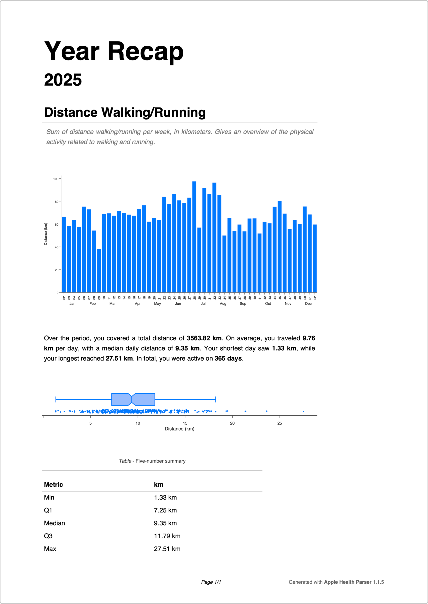

# Scripts

There are two scripts included in the `apple-health-parser` package at the moment:

- `apple-health-parser-export`: A script to export data from the Apple Health export file to CSV files
- `apple-health-parser-year-recap`: A script to generate a year recap of the Apple Health data

## Running the export script

The export script comes with a help command that lists all available options and commands:

```bash
❯ apple-health-parser-export --help
Usage: apple-health-parser-export [OPTIONS]

  CLI to export data from the Apple Health export file to CSV files.

Options:
  --zip_file TEXT  Path to the Apple Health export.zip file
  --dir_name TEXT  Directory to export the CSV files to. If None, uses the
                   current directory
  --help           Show this message and exit.
```

To run the CLI, simply execute the following command in your terminal:

```bash
apple-health-parser-export --zip_file <export.zip> --dir_name <output_directory>
```

!!! note

    The `--dir_name` argument is optional. If not provided, the current directory will be used.

## Running the year recap script

The year recap script also comes with a help command that lists all available options and commands:

```bash
Usage: apple-health-parser-year-recap [OPTIONS]

  CLI to export the year recap from the Apple Health export file to a PDF
  file.

  Args:     zip_file (str): Path to the Apple Health export.zip file     year
  (int, optional): Year to filter the data for, defaults to current year

Options:
  --zip_file TEXT  Path to the Apple Health export.zip file
  --year INTEGER   Year to filter the data for, defaults to current year
  --help           Show this message and exit.
```

To run the year recap script, simply execute the following command in your terminal:

```bash
apple-health-parser-year-recap --zip_file <export.zip> --year <year>
```

If the `--year` argument is not provided, the script will default to the current year. The generated PDF file will be saved in the current directory with the name `report.pdf`.

An example of the generated PDF report is shown below:

{ align=left width=75% }
